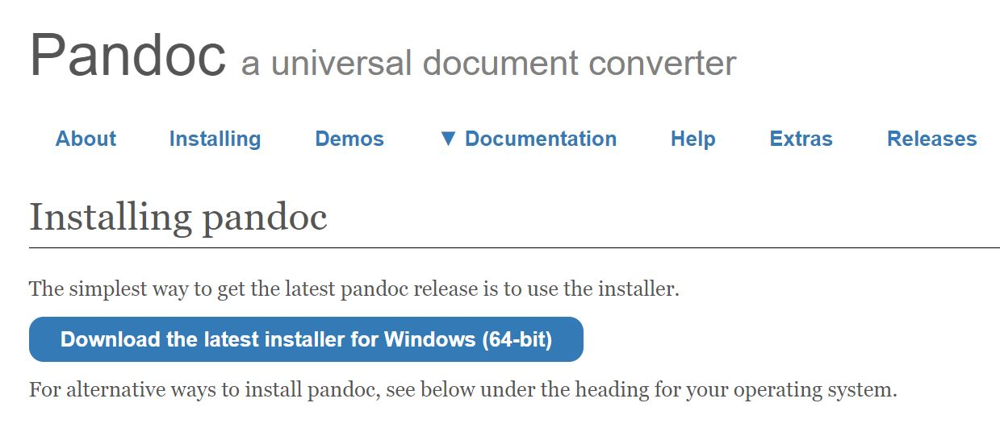
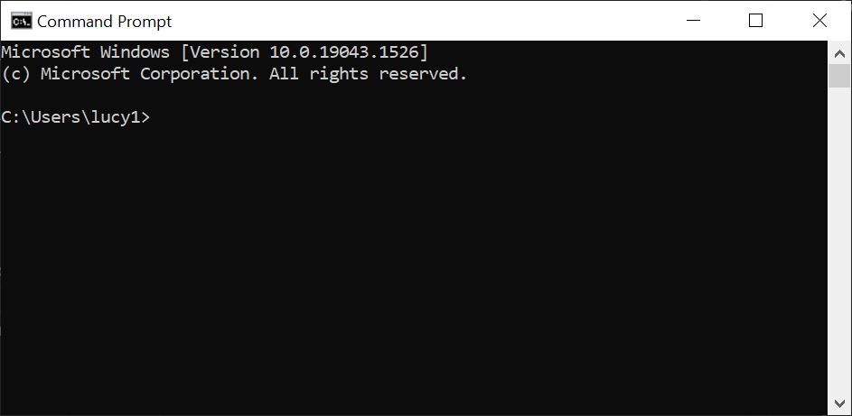

# How to Download and Install Pandoc

This guide will walk you through downloading and installing Pandoc, a universal document converter.

## Tools

- terminal

## Steps

1. **Go** to the Pandoc [website](https://pandoc.org/).
2. **Navigate** to the Installing tab (Figure 1).
3. **Download** the latest installer for your device.
4. **Install** Pandoc.
5. **Open** a terminal

   **note** for Windows use command prompt and for Mac use terminal

6. **Check** your Pandoc version with the command

   ``` linux
   pandoc -v
   ```

## Images

<figure>
   
   <figcaption>Figure 1: Pandoc download page.</figcaption>
</figure>

<figure>
   
   <figcaption>Figure 2: Windows Command Prompt.</figcaption>
</figure>


