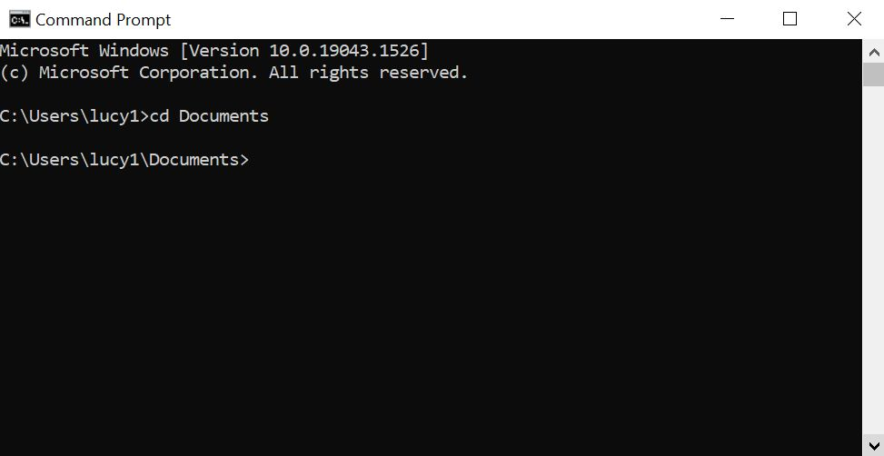

# How to Convert Word to Markdown

This guide will explain how to convert a word file to a markdown
file.

## Tools

- Pandoc
- terminal
- A word file

## Steps

1. **Open** a terminal.
2. **Change** the directory in your terminal with the cd command (Figure 1).

    ``` linux
    cd
    ```

3. **Navigate** to your word file in the terminal.
4. **Use** the pandoc command to covert your word file.

    ``` linux
    pandoc -s source_file.docx -o destination_file.md
    ```

    **Note** if you want to convert images as well, used the following command.

    ``` linux
    pandoc -s source_file.docx -t markdown --extract-media=images -o destination_file.md
    ```

5. **Clean** up the newly created file.

## Images

<figure>
   
   <figcaption>Figure 1:  Using the cd command to switch directories.</figcaption>
</figure>


